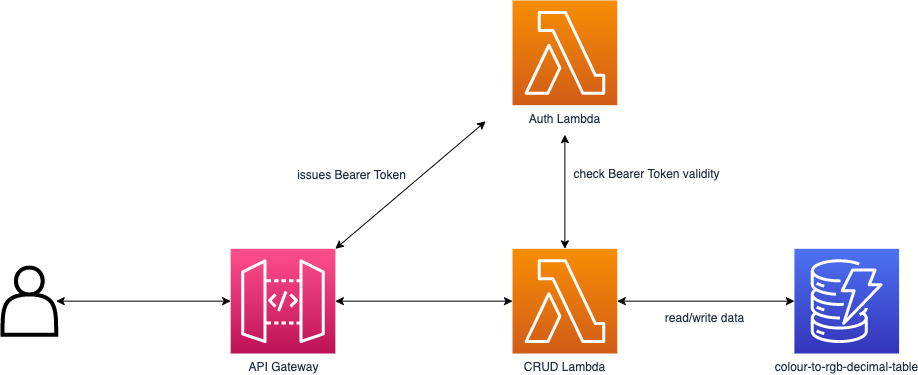

> For Sourced Group Interview Technical Challenge

# colour-to-rgb-decimal

REST API that when given colour in string format, return RGB decimal value.

```http
>> GET /colours/red
<< {colour: 'red', rgb: '(255,0,0)'}

>> GET /colours/green
<< {colour: 'green', rgb: '(0,255,0)'}

>> GET /colours/blue
<< {colour: 'blue', rgb: '(0,0,255)'}
```

## Table of Contents

<details>
<summary> Click to expand! </summary>

- [Assumed Requirements](#assumed-requirements)
  - [Functional Requirements](#functional-requirements)
    - [1. API will support the following colour as version 1](#1-api-will-support-the-following-colour-as-version-1)
    - [2. Colour string will always be in lowercase](#2-colour-string-will-always-be-in-lowercase)
    - [3. Clients will be able to get all colour string to RGB mapping](#3-clients-will-be-able-to-get-all-colour-string-to-rgb-mapping)
    - [4. Clients will be able to get individual colour string to RGB mapping](#4-clients-will-be-able-to-get-individual-colour-string-to-rgb-mapping)
    - [5. Authorized users will be allowed to add new colour string to RGB mapping](#5-authorized-users-will-be-allowed-to-add-new-colour-string-to-rgb-mapping)
    - [6. Authorized users will be allowed to delete existing colour string to RGB mapping](#6-authorized-users-will-be-allowed-to-delete-existing-colour-string-to-rgb-mapping)
  - [Non-functional requirements](#non-functional-requirements)
    - [1. Must be able to support 1000 concurrent requests](#1-must-be-able-to-support-1000-concurrent-requests)
    - [2. Response time must be &lt; 1s](#2-response-time-must-be--1s)
- [API Endpoint Usage](#api-endpoint-usage)
  - [1. Add/Update colour to RGB decimal](#1-addupdate-colour-to-rgb-decimal)
  - [2. Get all colour to RGB decimal](#2-get-all-colour-to-rgb-decimal)
  - [3. Get RGB decimal from colour](#3-get-rgb-decimal-from-colour)
  - [4. Delete colour to RGB decimal mapping](#4-delete-colour-to-rgb-decimal-mapping)
- [Tech Stack](#tech-stack)
- [Architecture Diagram](#architecture-diagram)
- [Running Locally](#running-locally)
- [Deployment](#deployment)
- [Future Improvement](#future-improvement)
  - [1. Caching](#1-caching)
  - [2. Monitoring / Logging / Analytics](#2-monitoring--logging--analytics)
  - [3. Deployment Pipeline](#3-deployment-pipeline)

</details>

## Assumed Requirements

### Functional Requirements

#### 1. API will support the following colour as version 1

| Colour            | Decimal Code  |
| ----------------- | ------------- |
| black             | (0,0,0)       |
| white             | (255,255,255) |
| red               | (255,0,0)     |
| lime              | (0,255,0)     |
| blue              | (0,0,255)     |
| yellow            | (255,255,0)   |
| cyan / aqua       | (0,255,255)   |
| magenta / fuchsia | (255,0,255)   |
| silver            | (192,192,192) |
| gray              | (128,128,128) |
| maroon            | (128,0,0)     |
| olive             | (128,128,0)   |
| green             | (0,128,0)     |
| purple            | (128,0,128)   |
| teal              | (0,128,128)   |
| navy              | (0,0,128)     |

#### 2. Colour string will always be in lowercase

- When there is a need for a space in colour string, it will be denoted by `-`. For example: `dark-red`

#### 3. Clients will be able to get all colour string to RGB mapping

- Response will be a list containing objects of existing colour to RGB mapping

```json
[
  {
    "colour": "orange",
    "rgb": "(255,165,0)"
  },
  {
    "colour": "red",
    "rgb": "(255,0,0)"
  },
  ...
]
```

#### 4. Clients will be able to get individual colour string to RGB mapping

- Response will be an object which represent a colour to RGB mapping

```json
{
  "colour": "red",
  "rgb": "(255,0,0)"
}
```

#### 5. Authorized users will be allowed to add new colour string to RGB mapping

- if colour string does not exists, do an upsert
- if colour string exists but the decimal colour are different, do an upsert
- if colour string exists and decimal colour are the same do nothing
- added colour will always will be in the following format, no input verification is required

```json
{
  "colour": "{colour_name_in_string}",
  "rgb": "{rgb_decimal_code}"
}

// e.g
{
  "colour": "green",
  "rgb": "(0,255,0)"
}
```

#### 6. Authorized users will be allowed to delete existing colour string to RGB mapping

### Non-functional requirements

#### 1. Must be able to support 1000 concurrent requests

#### 2. Response time must be < 1s

## API Endpoint Usage

| No. | Method | URI                           | Request Body                             | Requires Bearer Token |
| --- | ------ | ----------------------------- | ---------------------------------------- | :-------------------: |
| 1   | PUT    | `/colours`                    | `{colour: 'orange', rgb: '(255,165,0)'}` |          ✅           |
| 2   | GET    | `/colours`                    | -                                        |          ❌           |
| 3   | GET    | `/colours/{colour-in-string}` | -                                        |          ❌           |
| 4   | DELETE | `/colours/{colour-in-string}` | -                                        |          ✅           |

#### 1. Add/Update colour to RGB decimal

```http
>> PUT /colours Bearer: true {colour: 'orange', rgb: '(255,165,0)'}
<< {colour: 'orange', rgb: '(255,165,0)'}
```

#### 2. Get all colour to RGB decimal

```http
>> GET /colours
<< [ {colour: 'red', rgb: '(255,0,0)'}, {colour: 'green', rgb: '(0,255,0)'}, ... ]
```

#### 3. Get RGB decimal from colour

```http
>> GET /colours/blue
<< {colour: 'blue', rgb: '(0,0,255)'}
```

#### 4. Delete colour to RGB decimal mapping

```http
>> DELETE /colours/blue
<< {"message": "Successfully deleted blue"}
```

## Tech Stack

- [AWS Chalice](https://github.com/aws/chalice) -- Python Serverless Microframework for AWS

  - To Build CRUD REST API with API Gateway + Lambda

- [AWS Cloudformation](https://aws.amazon.com/cloudformation/) -- Provision infrastructure as code

  - Deploying dynamoDB using cloudformation template

## Architecture Diagram



## Running locally

Requirements:

- Python 3.7 and above
- AWS credentials configured in `~/.aws/credentials`

```bash
pip install chalice
cd app
chalice local
```

## Deployment

```bash
cd app
chalice deploy
```

## Future Improvement

#### 1. Caching

Currently, there is no caching of result. Whenever data related operation is carried out, dynamoDB table is scanned/queried.

This could lead to high charges for dynamoDB and increased latency for client.

Could add a caching layer in the system. Either before hitting the dynamoDB or at API Gateway itself.

#### 2. Monitoring / Logging / Analytics

Only basic cloudwatch logs for now.

Could add workers to process the usage pattern of the API.

#### 3. Deployment Pipeline

Could setup a deployment pipeline to automatically push changeset to production
